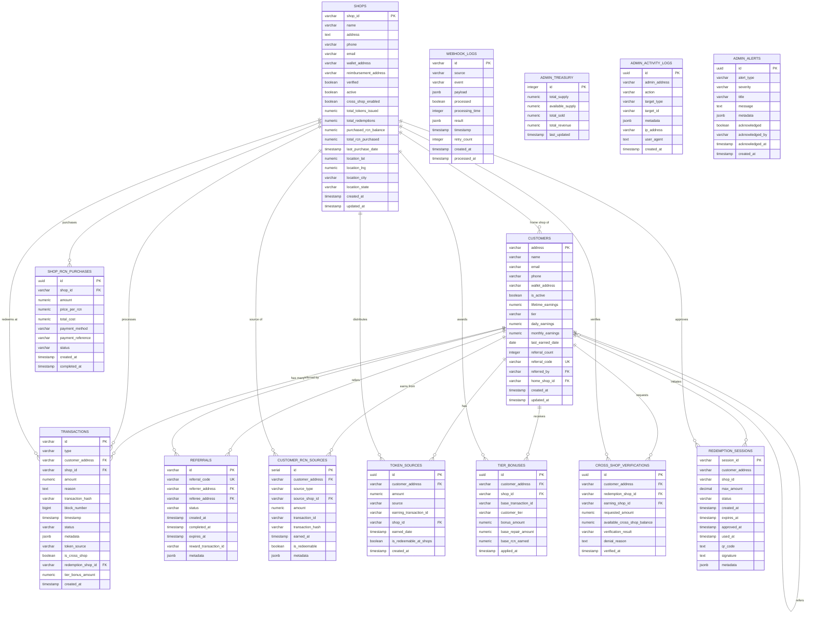

# RepairCoin Database Entity Relationship Diagram (ERD)

## Overview
This document describes the database schema and relationships for the RepairCoin platform, a blockchain-based loyalty rewards system for repair shops.

## Database Entities

### 1. **customers**
Stores customer information and their RCN token earning statistics.

| Column | Type | Description |
|--------|------|-------------|
| **address** (PK) | VARCHAR(42) | Customer's blockchain wallet address |
| name | VARCHAR(255) | Customer's full name |
| email | VARCHAR(255) | Customer's email address |
| phone | VARCHAR(20) | Customer's phone number |
| wallet_address | VARCHAR(42) | Customer's wallet address (redundant with address) |
| is_active | BOOLEAN | Whether customer account is active |
| lifetime_earnings | NUMERIC(20,8) | Total RCN earned lifetime |
| tier | VARCHAR(20) | Customer tier: BRONZE, SILVER, or GOLD |
| daily_earnings | NUMERIC(20,8) | RCN earned today |
| monthly_earnings | NUMERIC(20,8) | RCN earned this month |
| last_earned_date | DATE | Last date customer earned RCN |
| referral_count | INTEGER | Number of successful referrals |
| referral_code | VARCHAR(20) | Unique referral code for customer |
| referred_by | VARCHAR(42) | Address of referrer (if referred) |
| home_shop_id | VARCHAR(50) | Primary shop where customer earns |
| created_at | TIMESTAMP | Account creation timestamp |
| updated_at | TIMESTAMP | Last update timestamp |

### 2. **shops**
Stores repair shop information and their RCN token management data.

| Column | Type | Description |
|--------|------|-------------|
| **shop_id** (PK) | VARCHAR(100) | Unique shop identifier |
| name | VARCHAR(255) | Shop business name |
| address | TEXT | Physical address |
| phone | VARCHAR(20) | Shop phone number |
| email | VARCHAR(255) | Shop email address |
| wallet_address | VARCHAR(42) | Shop's blockchain wallet address |
| reimbursement_address | VARCHAR(42) | Address for USDC reimbursements |
| verified | BOOLEAN | Whether shop is verified by admin |
| active | BOOLEAN | Whether shop is currently active |
| cross_shop_enabled | BOOLEAN | Allows cross-shop redemptions |
| total_tokens_issued | NUMERIC(20,8) | Total RCN issued to customers |
| total_redemptions | NUMERIC(20,8) | Total RCN redeemed by customers |
| total_reimbursements | NUMERIC(20,8) | Total USDC reimbursements received |
| purchased_rcn_balance | NUMERIC(20,8) | Current RCN balance purchased from admin |
| total_rcn_purchased | NUMERIC(20,8) | Total RCN ever purchased |
| last_purchase_date | TIMESTAMP | Last RCN purchase date |
| minimum_balance_alert | NUMERIC(20,8) | Alert threshold for low RCN |
| auto_purchase_enabled | BOOLEAN | Auto-purchase when low |
| auto_purchase_amount | NUMERIC(20,8) | Amount to auto-purchase |
| fixflow_shop_id | VARCHAR(100) | External FixFlow system ID |
| location_lat | NUMERIC(10,8) | Latitude coordinate |
| location_lng | NUMERIC(11,8) | Longitude coordinate |
| location_city | VARCHAR(100) | City location |
| location_state | VARCHAR(100) | State/Province |
| location_zip_code | VARCHAR(20) | ZIP/Postal code |
| join_date | TIMESTAMP | Shop registration date |
| last_activity | TIMESTAMP | Last transaction timestamp |
| created_at | TIMESTAMP | Record creation timestamp |
| updated_at | TIMESTAMP | Last update timestamp |

### 3. **transactions**
Records all RCN token transactions on the platform.

| Column | Type | Description |
|--------|------|-------------|
| **id** (PK) | VARCHAR(100) | Unique transaction identifier |
| type | VARCHAR(20) | Transaction type: mint, redeem, transfer, tier_bonus, shop_purchase |
| customer_address (FK) | VARCHAR(42) | Customer wallet address |
| shop_id (FK) | VARCHAR(100) | Shop identifier |
| amount | NUMERIC(20,8) | RCN amount |
| reason | TEXT | Transaction description |
| transaction_hash | VARCHAR(66) | Blockchain transaction hash |
| block_number | BIGINT | Blockchain block number |
| timestamp | TIMESTAMP | Transaction timestamp |
| status | VARCHAR(20) | Status: pending, confirmed, failed |
| metadata | JSONB | Additional transaction data |
| token_source | VARCHAR(20) | Source: earned, purchased, tier_bonus |
| source_classification | VARCHAR(20) | Classification: earned or market |
| is_cross_shop | BOOLEAN | Whether cross-shop redemption |
| redemption_shop_id (FK) | VARCHAR(100) | Shop where redeemed (if different) |
| tier_bonus_amount | NUMERIC(20,8) | Tier bonus amount included |
| base_amount | NUMERIC(20,8) | Base amount before bonuses |
| created_at | TIMESTAMP | Record creation timestamp |
| confirmed_at | TIMESTAMP | Confirmation timestamp |

### 4. **referrals**
Tracks referral relationships between customers.

| Column | Type | Description |
|--------|------|-------------|
| **id** (PK) | VARCHAR(100) | Unique referral ID |
| referral_code | VARCHAR(20) | Unique referral code used |
| referrer_address (FK) | VARCHAR(42) | Referrer's wallet address |
| referee_address (FK) | VARCHAR(42) | Referee's wallet address |
| status | VARCHAR(20) | Status: pending, completed, expired |
| created_at | TIMESTAMP | Referral creation date |
| completed_at | TIMESTAMP | Completion date |
| expires_at | TIMESTAMP | Expiration date (30 days) |
| reward_transaction_id | VARCHAR(100) | Reward transaction ID |
| metadata | JSONB | Additional referral data |

### 5. **shop_rcn_purchases**
Records shops purchasing RCN tokens from RepairCoin admin.

| Column | Type | Description |
|--------|------|-------------|
| **id** (PK) | UUID | Unique purchase ID |
| shop_id (FK) | VARCHAR(100) | Shop identifier |
| amount | NUMERIC(20,8) | RCN amount purchased |
| price_per_rcn | NUMERIC(10,4) | Price per RCN token ($0.10) |
| total_cost | NUMERIC(20,8) | Total cost in USD |
| payment_method | VARCHAR(50) | Method: credit_card, bank_transfer, usdc |
| payment_reference | VARCHAR(255) | Payment reference number |
| status | VARCHAR(20) | Status: pending, completed, failed, refunded |
| created_at | TIMESTAMP | Purchase initiation date |
| completed_at | TIMESTAMP | Purchase completion date |

### 6. **customer_rcn_sources**
Tracks where customers earned their RCN tokens (for anti-arbitrage).

| Column | Type | Description |
|--------|------|-------------|
| **id** (PK) | SERIAL | Auto-increment ID |
| customer_address (FK) | VARCHAR(42) | Customer wallet address |
| source_type | VARCHAR(50) | Type: shop_repair, referral_bonus, tier_bonus, promotion, market_purchase |
| source_shop_id (FK) | VARCHAR(50) | Shop where earned |
| amount | NUMERIC(20,8) | RCN amount |
| transaction_id | VARCHAR(100) | Related transaction ID |
| transaction_hash | VARCHAR(66) | Blockchain hash |
| earned_at | TIMESTAMP | When earned |
| is_redeemable | BOOLEAN | Can be redeemed at shops |
| metadata | JSONB | Additional source data |

### 7. **token_sources**
Alternative token source tracking table.

| Column | Type | Description |
|--------|------|-------------|
| **id** (PK) | UUID | Unique source ID |
| customer_address (FK) | VARCHAR(42) | Customer wallet address |
| amount | NUMERIC(20,8) | RCN amount |
| source | VARCHAR(20) | Source: earned, tier_bonus, shop_distributed |
| earning_transaction_id | VARCHAR(100) | Related transaction |
| shop_id (FK) | VARCHAR(100) | Shop identifier |
| earned_date | TIMESTAMP | When earned |
| is_redeemable_at_shops | BOOLEAN | Shop redeemability |
| created_at | TIMESTAMP | Record creation date |

### 8. **tier_bonuses**
Tracks tier bonus distributions to customers.

| Column | Type | Description |
|--------|------|-------------|
| **id** (PK) | UUID | Unique bonus ID |
| customer_address (FK) | VARCHAR(42) | Customer wallet address |
| shop_id (FK) | VARCHAR(100) | Shop giving bonus |
| base_transaction_id | VARCHAR(100) | Base repair transaction |
| customer_tier | VARCHAR(20) | Tier: BRONZE, SILVER, GOLD |
| bonus_amount | NUMERIC(20,8) | Bonus RCN amount |
| base_repair_amount | NUMERIC(20,8) | Repair cost in USD |
| base_rcn_earned | NUMERIC(20,8) | Base RCN before bonus |
| applied_at | TIMESTAMP | When bonus applied |

### 9. **cross_shop_verifications**
Logs cross-shop redemption verification attempts.

| Column | Type | Description |
|--------|------|-------------|
| **id** (PK) | UUID | Unique verification ID |
| customer_address (FK) | VARCHAR(42) | Customer wallet address |
| redemption_shop_id (FK) | VARCHAR(100) | Shop attempting redemption |
| earning_shop_id (FK) | VARCHAR(100) | Shop where earned |
| requested_amount | NUMERIC(20,8) | Requested redemption amount |
| available_cross_shop_balance | NUMERIC(20,8) | Available for cross-shop |
| verification_result | VARCHAR(20) | Result: approved, denied, insufficient_balance |
| denial_reason | TEXT | Reason if denied |
| verified_at | TIMESTAMP | Verification timestamp |

### 10. **redemption_sessions**
Manages customer-initiated redemption approval sessions.

| Column | Type | Description |
|--------|------|-------------|
| **session_id** (PK) | VARCHAR(255) | Unique session ID |
| customer_address | VARCHAR(42) | Customer wallet address |
| shop_id | VARCHAR(100) | Target shop ID |
| max_amount | DECIMAL(20,2) | Maximum redemption amount |
| status | VARCHAR(20) | Status: pending, approved, rejected, expired, used |
| created_at | TIMESTAMP | Session creation time |
| expires_at | TIMESTAMP | Session expiration time |
| approved_at | TIMESTAMP | Approval timestamp |
| used_at | TIMESTAMP | Usage timestamp |
| qr_code | TEXT | QR code data |
| signature | TEXT | Digital signature |
| metadata | JSONB | Additional session data |

### 11. **webhook_logs**
Logs all webhook events from external systems.

| Column | Type | Description |
|--------|------|-------------|
| **id** (PK) | VARCHAR(100) | Unique webhook ID |
| source | VARCHAR(20) | Source: fixflow, admin, customer |
| event | VARCHAR(100) | Event type |
| payload | JSONB | Event payload data |
| processed | BOOLEAN | Processing status |
| processing_time | INTEGER | Processing time in ms |
| result | JSONB | Processing result |
| timestamp | TIMESTAMP | Event timestamp |
| retry_count | INTEGER | Number of retries |
| created_at | TIMESTAMP | Record creation date |
| processed_at | TIMESTAMP | Processing timestamp |

### 12. **admin_treasury**
Tracks RCN token supply and sales (singleton table).

| Column | Type | Description |
|--------|------|-------------|
| **id** (PK) | INTEGER | Always 1 (singleton) |
| total_supply | NUMERIC(20,8) | Total RCN supply (1B) |
| available_supply | NUMERIC(20,8) | Available for sale |
| total_sold | NUMERIC(20,8) | Total RCN sold to shops |
| total_revenue | NUMERIC(20,8) | Total revenue in USD |
| last_updated | TIMESTAMP | Last update timestamp |

### 13. **admin_activity_logs**
Tracks all admin actions for audit purposes.

| Column | Type | Description |
|--------|------|-------------|
| **id** (PK) | UUID | Unique log ID |
| admin_address | VARCHAR(42) | Admin wallet address |
| action | VARCHAR(100) | Action performed |
| target_type | VARCHAR(50) | Target entity type |
| target_id | VARCHAR(100) | Target entity ID |
| metadata | JSONB | Action details |
| ip_address | VARCHAR(45) | Admin IP address |
| user_agent | TEXT | Browser user agent |
| created_at | TIMESTAMP | Action timestamp |

### 14. **admin_alerts**
Stores system alerts for admin attention.

| Column | Type | Description |
|--------|------|-------------|
| **id** (PK) | UUID | Unique alert ID |
| alert_type | VARCHAR(50) | Alert category |
| severity | VARCHAR(20) | Severity: info, warning, critical |
| title | VARCHAR(255) | Alert title |
| message | TEXT | Alert message |
| metadata | JSONB | Additional alert data |
| acknowledged | BOOLEAN | Acknowledgment status |
| acknowledged_by | VARCHAR(42) | Admin who acknowledged |
| acknowledged_at | TIMESTAMP | Acknowledgment time |
| created_at | TIMESTAMP | Alert creation time |

## Entity Relationships

### Primary Relationships

1. **customers ← → transactions** (1:N)
   - One customer can have many transactions
   - Every transaction belongs to one customer
   - Foreign Key: `transactions.customer_address` → `customers.address`

2. **shops ← → transactions** (1:N)
   - One shop can have many transactions
   - Every transaction belongs to one shop
   - Foreign Key: `transactions.shop_id` → `shops.shop_id`

3. **shops ← → transactions (redemption)** (1:N)
   - One shop can have many redemption transactions
   - Foreign Key: `transactions.redemption_shop_id` → `shops.shop_id`

4. **customers ← → referrals (referrer)** (1:N)
   - One customer can refer many others
   - Foreign Key: `referrals.referrer_address` → `customers.address`

5. **customers ← → referrals (referee)** (1:N)
   - One customer can be referred by one other
   - Foreign Key: `referrals.referee_address` → `customers.address`

6. **shops ← → shop_rcn_purchases** (1:N)
   - One shop can make many RCN purchases
   - Foreign Key: `shop_rcn_purchases.shop_id` → `shops.shop_id`

7. **customers ← → customer_rcn_sources** (1:N)
   - One customer can have many RCN sources
   - Foreign Key: `customer_rcn_sources.customer_address` → `customers.address`

8. **shops ← → customer_rcn_sources** (1:N)
   - One shop can be source for many customer earnings
   - Foreign Key: `customer_rcn_sources.source_shop_id` → `shops.shop_id`

9. **customers ← → token_sources** (1:N)
   - One customer can have many token sources
   - Foreign Key: `token_sources.customer_address` → `customers.address`

10. **shops ← → token_sources** (1:N)
    - One shop can be source for many tokens
    - Foreign Key: `token_sources.shop_id` → `shops.shop_id`

11. **customers ← → tier_bonuses** (1:N)
    - One customer can receive many tier bonuses
    - Foreign Key: `tier_bonuses.customer_address` → `customers.address`

12. **shops ← → tier_bonuses** (1:N)
    - One shop can give many tier bonuses
    - Foreign Key: `tier_bonuses.shop_id` → `shops.shop_id`

13. **customers ← → cross_shop_verifications** (1:N)
    - One customer can have many verification attempts
    - Foreign Key: `cross_shop_verifications.customer_address` → `customers.address`

14. **shops ← → cross_shop_verifications (redemption)** (1:N)
    - One shop can have many redemption verifications
    - Foreign Key: `cross_shop_verifications.redemption_shop_id` → `shops.shop_id`

15. **shops ← → cross_shop_verifications (earning)** (1:N)
    - One shop can be earning source for many verifications
    - Foreign Key: `cross_shop_verifications.earning_shop_id` → `shops.shop_id`

16. **customers ← → customers (referral)** (1:N)
    - One customer can refer many others
    - Foreign Key: `customers.referred_by` → `customers.address`

17. **shops ← → customers (home shop)** (1:N)
    - One shop can be home shop for many customers
    - Foreign Key: `customers.home_shop_id` → `shops.shop_id`

## ERD Diagram (Mermaid Format)

## Business Rules & Constraints

### Customer Tiers
- **BRONZE**: 0-199 lifetime RCN earned (+10 RCN bonus per repair)
- **SILVER**: 200-999 lifetime RCN earned (+20 RCN bonus per repair)
- **GOLD**: 1000+ lifetime RCN earned (+30 RCN bonus per repair)

### Token Economics
- Shops purchase RCN at $0.10 per token from admin
- Customers redeem RCN at $0.10 value within shop network
- Market-purchased RCN cannot be redeemed at shops (anti-arbitrage)
- Cross-shop redemption limited to 20% of earned balance

### Referral System
- Referrer receives 25 RCN after referee completes first repair
- Referee receives 10 RCN bonus on first repair
- Referral links expire after 30 days

### Daily/Monthly Limits
- Daily earning limit: 40 RCN (excluding bonuses)
- Monthly earning limit: 500 RCN (excluding bonuses)

## Indexes for Performance

The database includes numerous indexes for optimal query performance:
- Customer lookups by tier, activity status, and earnings
- Shop lookups by verification status, location, and activity
- Transaction lookups by type, status, customer, shop, and timestamp
- Referral lookups by code, addresses, and status
- Source tracking for anti-arbitrage verification

## Views

### system_health
Provides real-time health check of all tables with row counts.

### referral_stats
Aggregates referral performance metrics per customer.

## Triggers

1. **update_updated_at_column**: Auto-updates `updated_at` timestamps
2. **assign_referral_code_trigger**: Auto-generates unique referral codes
3. **track_rcn_source_trigger**: Tracks RCN earning sources for verification

## Notes

- All monetary values stored as NUMERIC(20,8) for precision
- Wallet addresses stored as VARCHAR(42) for Ethereum compatibility
- JSONB used for flexible metadata storage
- UUID used for non-blockchain primary keys
- Extensive foreign key relationships maintain referential integrity
- Check constraints ensure data validity (e.g., tier values, transaction types)