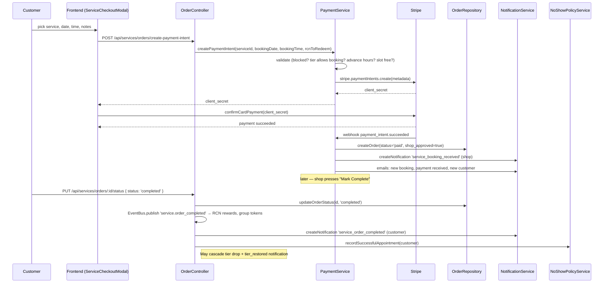

# Booking Flow — Customer Order Lifecycle

## Overview

A service booking moves through six stages: **payment intent created → pre-booking validation → Stripe payment confirmed → order row inserted → notifications dispatched → order completed**. The `service_orders` row is NOT written until Stripe confirms the payment, so there is no `pending` status in the DB — orders start life at `paid`. Shop manually marks the order `completed` after the appointment, which triggers event publication, RCN rewards, group tokens, and (for customers with no-show history) a tier cascade check.

## Sequence Diagram

## Stage-by-Stage

### Stage 1 — Create payment intent

- **Entry point:** `frontend/src/components/customer/ServiceCheckoutModal.tsx` posts to `createPaymentIntent()` in `frontend/src/services/api/services.ts:313`.
- **Route:** `POST /api/services/orders/create-payment-intent`.
- **Handler:** `backend/src/domains/ServiceDomain/controllers/OrderController.ts:39` (`createPaymentIntent`) — customer auth required, delegates to `PaymentService.createPaymentIntent` at line 61.

### Stage 2 — Pre-booking validation

All in `backend/src/domains/ServiceDomain/services/PaymentService.ts:125`:

| Check | Lines | Failure |
|---|---|---|
| Service exists + active | 128–135 | 404 / service unavailable |
| Customer blocked by shop | 137–142 | 403 |
| Customer no-show tier allows booking | 144–154 | 403 with suspension message if `!customerStatus.canBook` |
| Advance-hours requirement | 198 | `Math.max(config.minBookingHours, customerStatus.minimumAdvanceHours)` — tier floor applies |
| Slot capacity | 180–187 | 409 / slot full |
| Minimum notice | 189–195 | 400 |

If any fail, no Stripe intent is created. No DB row exists yet — the intent lives only in Stripe's metadata.

### Stage 3 — Payment confirmation (webhook)

- **Route:** `POST /api/services/webhooks/stripe` — raw body, `STRIPE_WEBHOOK_SECRET` verification.
- **Handler:** `PaymentService.handlePaymentSuccess()` at `backend/src/domains/ServiceDomain/services/PaymentService.ts:561`.
- **Idempotency:** line 567–575 — if an order already exists for this `paymentIntentId`, returns it instead of inserting a duplicate.
- **Insert:** line 607 — `OrderRepository.createOrder()` writes the `service_orders` row with `status='paid'`, `shop_approved=true`, `approvedAt=NOW()`, booking date/time, Stripe payment intent id, and amounts.

### Stage 4 — RCN redemption (optional)

If the customer opted to redeem RCN on the booking: `PaymentService.ts:636–658` calls `RcnRedemptionService.processRedemption()` which decrements their balance and writes a transaction row.

### Stage 5 — Notifications dispatched

- `service_booking_received` notification sent to the shop address (`PaymentService.ts:660–680`).
- Shop email: `sendNewBookingNotification()` — gated on preferences (`PaymentService.ts:685–724`).
- Shop email: `sendPaymentReceivedNotification()` — skipped when the order was 100% RCN-paid.
- Shop email: `sendNewCustomerNotification()` — only if this is the customer's first order at this shop (line 726–757).
- Customer email: `sendBookingConfirmation()` via `AppointmentReminderService` (line 759–767).
- Google Calendar event created if the shop has Calendar connected (line 769–800).

### Stage 6 — Completion

- **Route:** `PUT /api/services/orders/:orderId/status` with `{ status: 'completed' }`.
- **Handler:** `OrderController.updateOrderStatus()` at `backend/src/domains/ServiceDomain/controllers/OrderController.ts:300`.
- **Auth:** shop owner only (line 302–305).
- **Checks:** order belongs to this shop (line 321–328); order not already past the 24-hour completion window (line 331–348).
- **Transition:** `OrderRepository.updateOrderStatus(id, 'completed')` sets `status='completed'` and `completed_at=NOW()`.
- **Event:** `EventBus.publish('service.order_completed')` at line 355–367 — subscribers include the RCN rewards system and the group-token issuer (`issueGroupTokensForService()` at line 375).
- **Notification:** `service_order_completed` to customer (line 389), after a 2-second delay to allow RCN minting to settle.
- **Tier cascade check:** `NoShowPolicyService.recordSuccessfulAppointment(customerAddress)` at line 449–460. If the customer is on a penalized tier (`deposit_required`, `caution`, or `warning`) and the counter crosses `shop_no_show_policy.deposit_reset_after_successful` (default 3), they drop one tier and receive a `tier_restored` notification. See [no-show-flow.md](./no-show-flow.md#tier-de-escalation).
- **Deposit refund:** if metadata marked `requiresDeposit=true`, partial Stripe refund is issued (`OrderController.ts:422–449`).

## Key Design Decisions

- **No `pending` status in DB.** Stripe failures leave nothing behind. This is by design — avoids garbage-collecting abandoned rows and simplifies `service_orders` queries. See `PaymentService.ts:123` comment.
- **Idempotent webhook.** Stripe may redeliver. The dedupe on `stripe_payment_intent_id` prevents duplicate orders.
- **Shop-manual completion.** There is no auto-completion; the shop must press "Mark Complete". Shops that forget will not issue RCN rewards. Auto-detection only covers no-shows, not completions.

## Notifications Emitted

| Type | Sender | Receiver | When | File:line |
|---|---|---|---|---|
| `service_booking_received` | SYSTEM | Shop | On payment success | `PaymentService.ts:667` |
| `service_order_completed` | SYSTEM | Customer | On shop mark-complete | `OrderController.ts:389` |
| `tier_restored` | SYSTEM | Customer | On cascade tier drop during completion | `NoShowPolicyService.ts` (`sendTierRestoredNotification`) |

Emails (preference-gated, sent via `EmailService`): `sendNewBookingNotification`, `sendPaymentReceivedNotification`, `sendNewCustomerNotification`, `sendBookingConfirmation`.
