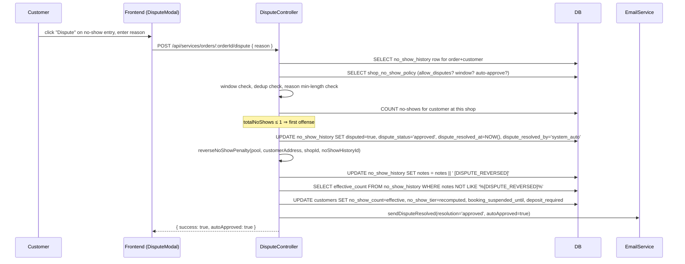

# Dispute Flow — Contesting a No-Show

## Overview

A customer marked as no-show may contest the record. If the shop's policy has `auto_approve_first_offense=true` and this is the customer's first or second no-show at the shop, the dispute is approved and reversed immediately without shop review. Otherwise the dispute enters `pending` state and waits for the shop (or an admin) to approve or reject it. Approval marks the `no_show_history` row as reversed, recomputes the customer's `effective_count` excluding reversed rows, and re-tiers accordingly.

## Dispute Window

- **Column:** `shop_no_show_policy.dispute_window_days` (default 7).
- **Enforcement:** `DisputeController.ts:145–156`. If `NOW() - marked_no_show_at > dispute_window_days`, submission is rejected with `403`.
- **Rationale:** bounds the period during which shops must retain enough context to adjudicate.

## Auto-Approve First Offense

- **Policy flag:** `shop_no_show_policy.auto_approve_first_offense` (default `true`).
- **Check:** `DisputeController.ts:158–188`. Counts the customer's total no-show records at this shop; if ≤ 1 (i.e., the record under dispute is their 1st or 2nd), the dispute is auto-approved.
- **Effect:** `dispute_status='approved'`, `dispute_resolved_by='system_auto'`, `dispute_resolution_notes='Auto-approved: first offense policy'`. Immediately calls `reverseNoShowPenalty()` (line 194).

## Sequence — Auto-Approve Path



## Sequence — Manual Review Path

```mermaid
sequenceDiagram
  participant Customer
  participant FE as Customer Frontend
  participant SD as Shop Dispute Dashboard
  participant DC as DisputeController
  participant DB
  participant ES as EmailService

  Customer->>FE: submit dispute (reason)
  FE->>DC: POST /api/services/orders/:orderId/dispute
  DC->>DB: UPDATE no_show_history SET dispute_status='pending', dispute_submitted_at=NOW()
  DC-->>FE: { success: true, autoApproved: false }

  Note over SD: Shop reviews in dispute dashboard
  alt approve
    SD->>DC: PUT /api/services/shops/:shopId/disputes/:id/approve { resolutionNotes? }
    DC->>DB: UPDATE no_show_history SET dispute_status='approved', dispute_resolved_by=shopAddress
    DC->>DC: reverseNoShowPenalty(...)
    DC->>ES: sendDisputeResolved(resolution='approved')
  else reject
    SD->>DC: PUT /api/services/shops/:shopId/disputes/:id/reject { resolutionNotes }
    DC->>DB: UPDATE no_show_history SET dispute_status='rejected', dispute_resolved_by=shopAddress
    Note right of DC: no penalty reversal; no-show stands
    DC->>ES: sendDisputeResolved(resolution='rejected')
  end
```

## `reverseNoShowPenalty` Mechanics

Function at `backend/src/domains/ServiceDomain/controllers/DisputeController.ts:677–752`. Module-private. Called from:

- `submitDispute` (line 194) — when auto-approved on first offense.
- `approveDispute` (line 404) — on shop approval of a pending dispute.
- `adminResolveDispute` (line 655) — on admin resolution of any dispute.

Steps:

1. **Mark, don't delete** (line 685–689): append `[DISPUTE_REVERSED]` to the record's `notes`. The row stays for audit.
2. **Recompute effective count** (line 691–698): `SELECT COUNT(*) FROM no_show_history WHERE customer_address = ? AND (notes IS NULL OR notes NOT LIKE '%[DISPUTE_REVERSED]%')`.
3. **Look up this shop's policy thresholds** (line 705–733). Fall back to defaults (caution=2, deposit=3, suspension=5, suspension_duration=30 days) if the shop has no policy row.
4. **Re-tier** from `effective_count`. If the new tier is `suspended`, compute a fresh `booking_suspended_until`.
5. **UPDATE** `customers` with the new `no_show_count` (= effective), new `no_show_tier`, new `booking_suspended_until`, and `deposit_required = (tier in ['deposit_required','suspended'])`.

This is the **only** path that decrements `no_show_count`. Cascade reset and suspension auto-lift both preserve the count as lifetime history.

## Admin Override

`adminResolveDispute` at `DisputeController.ts:600` bypasses the shop-review requirement and lets an admin approve or reject on the shop's behalf. Same reversal mechanics.

## Endpoints

| Endpoint | Handler | Auth |
|---|---|---|
| `POST /api/services/orders/:orderId/dispute` | `submitDispute` | Customer |
| `PUT /api/services/shops/:shopId/disputes/:id/approve` | `approveDispute` | Shop owner or admin |
| `PUT /api/services/shops/:shopId/disputes/:id/reject` | `rejectDispute` | Shop owner or admin |
| `GET /api/services/shops/:shopId/disputes` | `getShopDisputes` | Shop owner or admin |
| `GET /api/admin/disputes` | `getAdminDisputes` | Admin only |

## Notifications

Currently **email-only** — no in-app notification is emitted for dispute submission, approval, or rejection. Customers receive:

| Email | Trigger | File:line |
|---|---|---|
| `sendDisputeResolved` (approved, auto) | Auto-approved first offense | `DisputeController.ts:199–235` |
| `sendDisputeResolved` (approved, manual) | Shop approves | `DisputeController.ts:408–425` |
| `sendDisputeResolved` (rejected) | Shop rejects | `DisputeController.ts:500–517` |

**Future work:** an in-app `dispute_resolved` notification type. Not emitted today; `notifications` table rows are not written from any dispute path.

## Historical Bug

`DisputeController.ts:696` previously read `nocctes NOT LIKE` instead of `notes NOT LIKE`. Any dispute approval would throw `column "nocctes" does not exist` at runtime. Fixed; a static regression test in `backend/tests/services/dispute-reversal.test.ts` guards against reintroduction.
