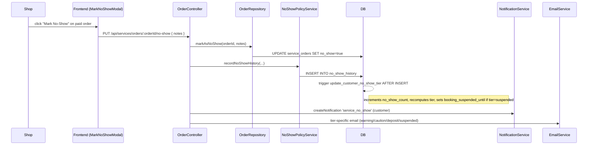
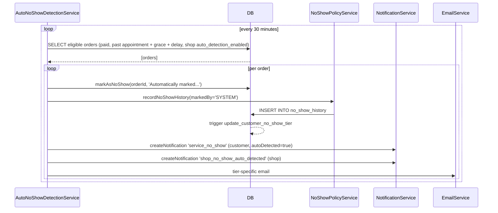

# No-Show Flow — Penalty Tier System

## Overview

Customers who miss appointments accrue a `no_show_count` and escalate through a four-step penalty ladder. Each step applies progressively stricter booking rules. Three mechanisms can move a customer back down: cascade reset (earn-back via successful appointments), suspension auto-lift (time-served), and dispute reversal (audit correction).

## Tier Ladder

Defaults from `shop_no_show_policy` (migration `082_create_shop_no_show_policy_and_email_preferences.sql:21`). A shop can override thresholds per its policy row.

| `no_show_count` | Tier | Restrictions |
|---|---|---|
| 0 | `normal` | None — full booking privileges |
| 1 | `warning` | Informational banner only; no enforcement |
| 2 | `caution` | Must book ≥ 24 h in advance; max 80% RCN redemption |
| 3–4 | `deposit_required` | Must book ≥ 48 h in advance; $25 refundable deposit per booking; max 80% RCN redemption |
| ≥ 5 | `suspended` | Booking blocked for 30 days; auto-lifts to `deposit_required` |

Thresholds live in `shop_no_show_policy` columns `caution_threshold`, `deposit_threshold`, `suspension_threshold`. Default values set in `backend/src/services/NoShowPolicyService.ts:141–170` (`getDefaultPolicy`).

## Manual No-Show — Sequence

## Auto-Detection — Sequence

- **Service:** `backend/src/services/AutoNoShowDetectionService.ts`.
- **Schedule:** starts on server boot, runs once immediately, then every 30 min (`INTERVAL_MS = 30 * 60 * 1000` at line 536).
- **Eligibility query** (line 90–137): `status IN ('paid', 'confirmed')`, `booking_date + booking_time + grace_period_minutes + auto_detection_delay_hours < NOW()`, shop has `auto_detection_enabled=true`.
- **Defaults:** 15 min grace + 2 h delay = 2 h 15 min wait past appointment.

## Tier Escalation

The trigger at `backend/migrations/065_recreate_no_show_tables.sql:192–238` (`update_customer_no_show_tier`) fires **AFTER INSERT on `no_show_history`** only. It:

1. Reads the shop's policy (or defaults if none).
2. Recomputes `no_show_tier` from the current `customers.no_show_count` vs thresholds.
3. If the new tier is `suspended`, sets `booking_suspended_until = NOW() + suspension_duration_days`.
4. Writes `customers.last_no_show_at = NEW.marked_no_show_at`.

The trigger does **not** increment `no_show_count` itself — that's done explicitly by `NoShowPolicyService.incrementCustomerNoShowCount()` (line 380–388), called at the end of `recordNoShowHistory()`. The trigger just re-derives the tier from whatever count is already on the row.

The trigger does **not** fire on UPDATE to `customers`, so the three de-escalation paths below are safe to write directly to the tier field.

## Tier De-escalation

There are three mechanisms that move a customer back down. They are mutually independent and compose correctly.

### 1. Cascade reset (earn-back via successful appointments)

- **Trigger:** shop marks a paid order `completed` (see [booking-flow.md](./booking-flow.md#stage-6--completion)).
- **Flow:** `NoShowPolicyService.recordSuccessfulAppointment()` → `checkTierReset()`.
- **Logic:** increments `customers.successful_appointments_since_tier3`; when the counter crosses `shop_no_show_policy.deposit_reset_after_successful` (default 3), drops the customer one tier (`deposit_required → caution → warning → normal`), resets the counter to 0, and emits a `tier_restored` notification.
- **Intermediate-step invariant:** `no_show_count` is preserved on `deposit_required → caution` and `caution → warning`. Only the active restriction tier moves at these steps.
- **Final-step full reset:** on `warning → normal` the same UPDATE also wipes `no_show_count = 0` and `last_no_show_at = NULL`. This gives the customer a genuine clean slate — a future miss takes them to `warning` (count 1), not back to their pre-cascade tier. `no_show_history` rows are NOT deleted; the audit trail remains. The `tier_restored` notification for this step carries `metadata.fullReset = true` and a distinct "history has been cleared" message.
- **Counter column:** `successful_appointments_since_tier3` was named for the original deposit-only reset. It now tracks successful appointments since the *last* tier drop across all penalized tiers. Rename deferred — migration `106_update_successful_appointments_counter_comment.sql` documents the new meaning via `COMMENT ON COLUMN`.

### 2. Suspension auto-lift (time-served)

- **Trigger:** `backend/src/services/SuspensionLiftService.ts` cron, every 15 min.
- **Condition:** `no_show_tier = 'suspended'` AND `booking_suspended_until <= NOW()`.
- **Action:** cascade to the appropriate tier based on current `no_show_count` (usually still `deposit_required` since count ≥ 5 right after suspension). Clears `booking_suspended_until`, resets `successful_appointments_since_tier3` to 0. Emits `suspension_lifted` notification.
- **Does not** decrement `no_show_count`.

### 3. Dispute reversal (audit correction)

See [dispute-flow.md](./dispute-flow.md). The customer (or admin, or shop) may reverse a *specific* `no_show_history` row. `reverseNoShowPenalty` recomputes `effective_count` excluding reversed rows and re-tiers accordingly — this is the only path that can *partially* decrement `no_show_count` (by as many as were reversed, not all the way to zero).

## Count vs. History — What's Mutable and When

The source-of-truth audit log is `no_show_history`. Rows there are never deleted; the worst that happens is a note-field flag (`[DISPUTE_REVERSED]`) that excludes a row from effective-count calculations. `customers.no_show_count` is a derived, denormalized counter used for fast tier lookups — and it has three mutation paths:

| Event | Effect on `no_show_count` |
|---|---|
| New no-show (`recordNoShowHistory`) | +1 (via `incrementCustomerNoShowCount`) |
| Cascade final step (`warning → normal`) | Set to 0 |
| Dispute approved (`reverseNoShowPenalty`) | Recomputed as `COUNT(no_show_history rows NOT marked reversed)` |

The cascade and dispute paths do not touch `no_show_history`. A customer reset to `no_show_count = 0` via the cascade still has their historical rows on file; admins running audit queries can see the full chain of events including the reset moment.

## Notifications Emitted

| Type | Sender | Receiver | When | File:line |
|---|---|---|---|---|
| `service_no_show` | SYSTEM | Customer | On manual mark + on auto-detection | `OrderController.ts:928`, `AutoNoShowDetectionService.ts:190` |
| `shop_no_show_auto_detected` | SYSTEM | Shop | On auto-detection only | `AutoNoShowDetectionService.ts:213` |
| `suspension_lifted` | SYSTEM | Customer | On cron-driven suspension lift | `SuspensionLiftService.ts:81` |
| `tier_restored` | SYSTEM | Customer | On cascade tier drop | `NoShowPolicyService.sendTierRestoredNotification` |

Tier-specific emails via `EmailService`: `sendNoShowTier1Warning`, `sendNoShowTier2Caution`, `sendNoShowTier3DepositRequired`, `sendNoShowTier4Suspended` — preference-gated per shop policy.
