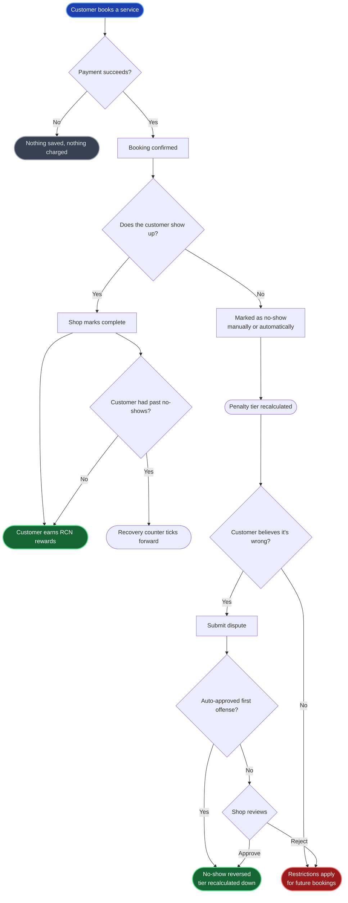
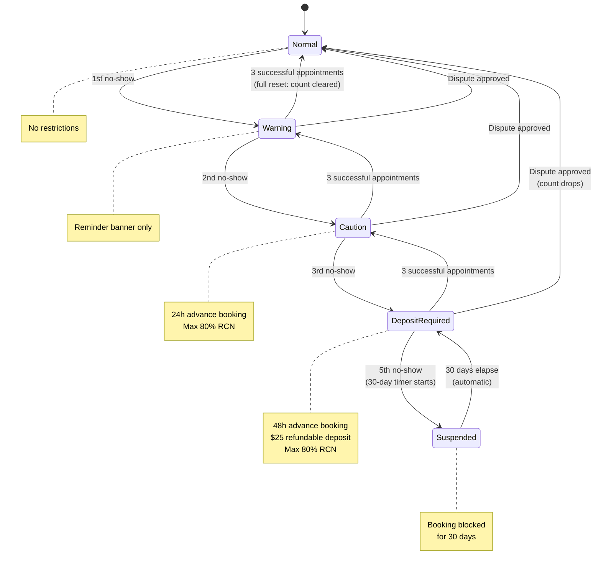
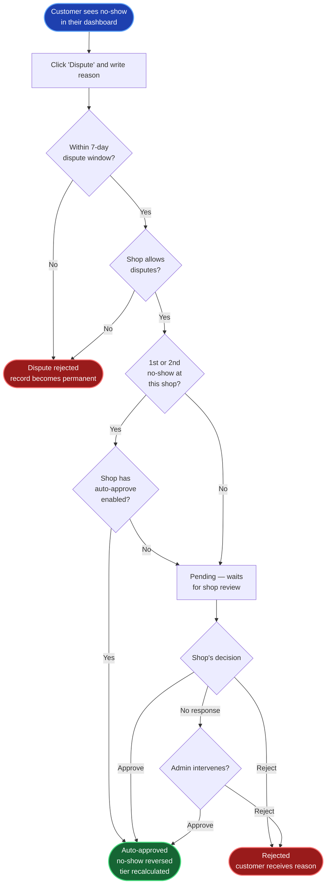

# Service Booking Lifecycle

*An end-to-end overview of what happens from the moment a customer books a service through completion, missed appointments, and disputes. Written for non-technical stakeholders.*

---

## What This Covers

RepairCoin's service marketplace lets customers book repair appointments online, pay upfront (with cash or RCN tokens), show up, and earn rewards for completing their service. The system also protects shops from customers who repeatedly book and don't show up, while giving customers a fair way to contest a no-show that wasn't their fault.

This document walks through the full journey: booking → appointment → outcome (completion or no-show) → any consequences → recovery.

## Big Picture

---

## 1. The Happy Path — A Successful Booking

Here is what a customer experiences when everything goes well.

**Step 1 — Browse and pick a service.** The customer opens the marketplace, chooses a shop, and selects a service (e.g., "Screen Replacement"). They see the price, estimated duration, and available time slots.

**Step 2 — Pick a date and time.** The customer selects an available slot. The system enforces the shop's operating hours, break times, and capacity limits automatically — unavailable slots are greyed out.

**Step 3 — Optionally redeem RCN tokens.** If the customer has earned RCN rewards at this shop (or any participating shop), they can apply some of them toward the bill. Up to 20% of their redemption can be used at any shop; up to 100% at the shop where they earned it.

**Step 4 — Check out.** The customer enters payment details. At this moment, no booking is saved yet — the system first confirms the customer is in good standing, the slot is still free, and the payment clears.

**Step 5 — Payment confirms.** Once the payment provider (Stripe) confirms funds, the booking is officially created. The customer gets a confirmation email and a calendar event. The shop gets a "new booking received" notification and — if the shop has Google Calendar connected — the appointment appears on the shop's calendar automatically.

**Step 6 — The appointment happens.** The customer arrives, the shop performs the service.

**Step 7 — Shop marks the booking complete.** The shop owner opens their dashboard and marks the service complete. This triggers:

- **RCN rewards** are issued to the customer's wallet based on the transaction amount and the customer's loyalty tier.
- **Group tokens** (for services linked to affiliate groups) are also issued automatically.
- A **completion notification** is sent to the customer.
- If the customer had any no-show history, their recovery counter ticks forward (see Section 5).

The transaction is now permanently recorded, and the customer can rate and review the service.

---

## 2. When a Customer Doesn't Show Up

Not every booking ends happily. A no-show is a booking where the customer paid (or reserved) but never arrived. Shops lose the slot, potentially turning away other customers.

There are two ways a booking becomes a no-show:

### Manual Marking
The shop owner reviews their upcoming bookings and marks a specific one as "no-show" after the appointment time passes. They can add a note for their records.

### Automatic Detection
For shops that opt in, the system checks every 30 minutes for bookings that:
- Were paid for,
- Are past their appointment time (plus a grace period, typically 15 minutes),
- Plus an additional delay window (typically 2 hours) to avoid flagging customers who are simply running late,
- Have not been marked complete.

These are automatically flagged as no-shows. The customer is notified, and the shop gets an "auto-detected no-show" alert so they can override if the customer actually did show up.

In both cases, the missed appointment is logged in the customer's no-show history and counts toward their penalty tier.

---

## 3. The Penalty Ladder

Every customer starts at **Normal**. As missed appointments accumulate, they climb a four-step penalty ladder. Each step adds restrictions to their ability to book future appointments, designed to compensate shops for the risk.

| Missed Appointments | Tier | What the Customer Experiences |
|---|---|---|
| 0 | **Normal** | No restrictions. Full booking privileges. |
| 1 | **Warning** | A banner appears reminding them to honor appointments. No booking restrictions yet. |
| 2 | **Caution** | Must book at least 24 hours in advance. Maximum 80% of the bill can be paid with RCN tokens (some cash must be paid). |
| 3–4 | **Deposit Required** | Must book at least 48 hours in advance. A $25 refundable deposit is required for each booking. 80% RCN redemption cap still applies. |
| 5+ | **Suspended** | Booking is blocked entirely for 30 days. After that, the customer returns to the "Deposit Required" tier. |

*Shops can adjust these thresholds and amounts for their individual business, but these are the platform defaults.*

The customer sees a banner in their dashboard describing their current tier and the restrictions that apply. The banner colors and tone escalate with the tier — yellow for Warning, orange for Caution, red for Deposit Required, grey for Suspended.

### The Tier Ladder, Visualized

Arrows going **up** (red, thicker) are climbed by missing appointments. Arrows going **down** (green) represent recovery — each one a separate mechanism the customer can use to reduce their restrictions.

---

## 4. How a Customer Reaches Each Tier

The ladder goes up when a missed appointment is logged. The system automatically recalculates the customer's tier based on their total number of no-shows and the shop's thresholds.

A customer who already has 4 missed appointments and misses a 5th one will jump from "Deposit Required" straight to "Suspended" — with a suspension end date 30 days out.

The customer is always notified when their tier changes, with an explanation of the new restrictions and tips for avoiding further missed appointments (set reminders, cancel at least 4 hours ahead, contact the shop if running late).

---

## 5. Earning Your Way Back — Three Recovery Paths

The system is strict but not unforgiving. There are three separate mechanisms that can reduce a customer's restrictions. They work independently and can combine.

### Path A — Good Behavior (Cascade Reset)

**How it works:** Every time the customer completes an appointment successfully, a counter increments. When the counter reaches **3 successful appointments**, the customer drops one step down the ladder.

- Deposit Required → Caution (after 3 successful visits)
- Caution → Warning (after 3 more)
- Warning → Normal (after 3 more)

The counter resets to zero at each step, so the customer has to earn another 3 successes to drop further.

**What happens at each step:**

- **Intermediate drops** (Deposit Required → Caution, Caution → Warning): the active restriction level moves down, but the customer's lifetime no-show count stays intact. Only disputes can reduce the count at these stages.
- **Final step — Warning → Normal:** once the customer clears the full cascade, their no-show count is **wiped to zero**. This is a clean slate, not just a cosmetic tier change. A later miss takes them back to Warning (count 1), not straight into deeper penalties. The individual no-show records stay on file for audit purposes, but they no longer count against the customer.

**When it happens:** Automatically, the moment the shop marks a booking complete. The customer gets a "Your restrictions have been reduced" notification at every step, and a special "Welcome back to good standing — history cleared" notification on the final step.

### Path B — Time Served (Suspension Auto-Lift)

**How it works:** Once a customer has been suspended for 30 days (the default — shops can configure this), the suspension automatically lifts. The customer is moved from "Suspended" back down to "Deposit Required" (or whichever tier their no-show count corresponds to).

**What stays the same:** The customer still has to pay the refundable deposit and book 48 hours in advance on their next booking. The suspension was a time-out, not a reset.

**When it happens:** Automatically, within 15 minutes of the suspension expiring. The customer gets a "You can book again" notification.

### Path C — Dispute Reversal

Sometimes a no-show record is wrong. The customer did show up, or there was a valid reason (a medical emergency, a shop error, a booking system glitch). In these cases, the customer can dispute the record. If the dispute is approved, the no-show is reversed — and the customer's count genuinely goes down, potentially moving them down one or more tiers instantly.

Disputes are the only mechanism that decreases the lifetime count. They exist to correct factual errors, not to forgive legitimate misses. Disputes are covered in detail in the next section.

---

## 6. The Dispute Process

A customer who believes a no-show was marked incorrectly has a fair, structured way to contest it.

### Submitting a Dispute

The customer opens the disputed no-show in their dashboard and clicks "Dispute." They write a reason (minimum 10 characters) explaining why the record is wrong. Common reasons:

- "I was there on time but the shop was closed"
- "I cancelled 6 hours ahead of the appointment via phone"
- "I was in the ER — here's a photo of the discharge paper" (attachments are a future enhancement)

### The Dispute Window

Disputes must be submitted within **7 days** (default; shops can configure) of the missed appointment. After that window closes, the record becomes permanent. This bounds the period during which shops need to recall the details.

### First-Offense Auto-Approval

To avoid punishing new customers for a single bad day, the system can automatically approve the first dispute a customer files at a given shop (or their second, if they've only had one prior no-show at that shop). This requires the shop has "Auto-approve first offense" enabled in their policy — it's on by default.

When auto-approved, the reversal happens immediately. The customer gets an "Your dispute was approved" email, their no-show count decreases, and their tier is recalculated.

### Manual Shop Review

For any dispute that isn't auto-approved, the dispute enters "Pending" status and appears in the shop's dispute dashboard. The shop reviews the customer's reason and decides:

- **Approve** — the no-show is reversed. The customer's count goes down and their tier is recalculated. They receive an email with the shop's resolution notes (if any).
- **Reject** — the no-show stands. The customer receives an email explaining the rejection reason (which the shop is required to provide).

### Admin Override

Platform admins can resolve any dispute on behalf of a shop — useful if the shop is non-responsive, if there's a pattern suggesting unfair rejections, or if the case involves multi-shop fraud.

### What "Reversal" Means Technically

When a dispute is approved, the no-show record is **not deleted** — it's marked with an internal reversal flag. This preserves the audit trail: a shop can always see that a record existed and was reversed, and admins investigating fraud or abuse have complete history. The customer's counts are recalculated from the non-reversed records.

### Dispute Flow at a Glance

---

## 7. Design Principles

A few ideas underpin the whole system:

**1. No charge without a booking.** The customer's card is only charged after all validations pass and the slot is held. If anything fails, nothing is saved and nothing is charged.

**2. Audit trail is permanent; the active count is earnable.** Every missed appointment is recorded in the audit log forever — shops and admins can always see what happened and when. But the *active* no-show count that drives restrictions gets wiped to zero once a customer completes the full cascade back to Normal. This rewards sustained good behavior without pretending the history didn't happen: the records remain, their consequences don't.

**3. Disputes are for correction, not forgiveness.** Disputes exist to fix factual errors. If the customer genuinely missed the appointment, they should use the good-behavior path (cascade reset), not dispute it. Using disputes as forgiveness would pollute shop data and waste review time.

**4. Shops have flexibility.** Most thresholds (how many no-shows trigger each tier, how much the deposit is, how long the suspension lasts, whether to auto-approve first offenses) are configurable per shop. Defaults exist so new shops don't have to make every decision upfront.

**5. Customers always know where they stand.** The dashboard banner shows their current tier, the exact restrictions, progress toward the next recovery step, and tips for avoiding further issues. There are no hidden penalties or surprise charges.

---

## 8. What Customers Are Notified About

Customers receive a mix of in-app notifications (a bell icon in the dashboard) and emails across the lifecycle:

| Event | Notification | Email |
|---|---|---|
| Booking confirmed | ✓ | ✓ |
| Appointment reminder (24h prior) | ✓ | ✓ |
| Service completed (RCN issued) | ✓ | — |
| No-show recorded | ✓ | ✓ (tier-specific copy) |
| Suspension timer lifted | ✓ | — |
| Restrictions reduced (cascade reset) | ✓ | — |
| Dispute submitted | — | — |
| Dispute approved | — | ✓ |
| Dispute rejected | — | ✓ |

*Email delivery is gated by each customer's preference settings — they can opt out of non-critical messages.*

---

## 9. What Shops Control

Each shop has a no-show policy that they can tune in their dashboard:

- **Grace period** — minutes past appointment time before a customer is considered no-show (default 15).
- **Auto-detection** — opt in to let the system automatically mark no-shows, or keep manual-only.
- **Thresholds** — how many no-shows trigger each tier (caution, deposit, suspension).
- **Deposit amount** — dollar amount for the deposit-required tier (default $25).
- **Advance-hours requirements** — how far ahead cautioned / deposit customers must book (defaults 24 / 48).
- **RCN redemption cap** — the maximum percentage of a bill that can be paid with tokens for restricted customers (default 80%).
- **Suspension duration** — how long the full booking block lasts (default 30 days).
- **Disputes** — whether customers can dispute at all, the window (default 7 days), and whether first offenses auto-approve.
- **Email alerts** — which tier transitions send the customer an email, and whether the shop gets a daily digest of their no-shows.

---

## Glossary

- **RCN** — RepairCoin's utility token, earned from repairs and redeemed for discounts. 1 RCN = $0.10 USD.
- **Tier** — a customer's current restriction level (Normal, Warning, Caution, Deposit Required, Suspended).
- **No-show count** — the total lifetime number of missed appointments. Moves down only through dispute reversal.
- **Recovery counter** — successful appointments since the customer's last tier drop. Moves the tier down when it hits the threshold.
- **Auto-detection** — the system's 30-minute sweep that marks no-shows without shop intervention.
- **Dispute window** — the time limit for submitting a dispute after a no-show is recorded (default 7 days).
- **Suspension** — a full block on new bookings for a fixed duration; lifts automatically.
