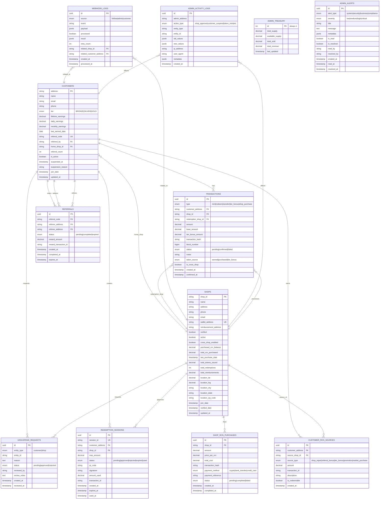

# RepairCoin Database ERD

## Entity Relationship Diagram

## Table Relationships Summary

### Primary Relationships:
1. **Customer → Shop**: Each customer has a home shop where they primarily earn RCN
2. **Customer → Transactions**: Customers have multiple token transactions (mint, redeem, transfer)
3. **Shop → Transactions**: Shops process customer transactions
4. **Customer → Referrals**: Customers can refer others and be referred
5. **Shop → Shop RCN Purchases**: Shops buy RCN tokens from the platform
6. **Customer → Customer RCN Sources**: Tracks where customers earned their tokens
7. **Customer/Shop → Redemption Sessions**: Temporary approval sessions for redemptions

### Key Business Rules Encoded:
- Customers progress through tiers (Bronze → Silver → Gold) based on lifetime earnings
- Shops must purchase RCN tokens at $0.10 each to distribute to customers
- Customers can use 20% of earned balance at non-home shops (cross-shop)
- Only earned tokens (not market-bought) can be redeemed at shops
- Referral rewards are distributed after referee completes first repair

## Database Design Principles

1. **Normalization**: Tables are properly normalized to avoid data redundancy
2. **Audit Trail**: All major entities have created_at and updated_at timestamps
3. **Soft Deletes**: Uses is_active/suspended flags instead of hard deletes
4. **Financial Accuracy**: Uses decimal types for all monetary values
5. **Blockchain Integration**: Stores transaction hashes and block numbers
6. **Extensibility**: JSONB fields for metadata allow flexible data storage