# RepairCoin User Flow Diagrams

## Overview
This document contains visual flowcharts for the most complex RepairCoin processes. These diagrams complement the detailed user flows in the feature documentation and provide a high-level overview of system interactions.

---

## 🔄 Core Transaction Flow

### **Customer Earning and Redemption Cycle**
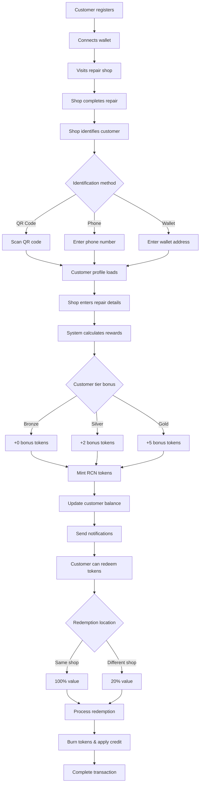

---

## 🏪 Shop Management Flow

### **Shop Application to Active Status**
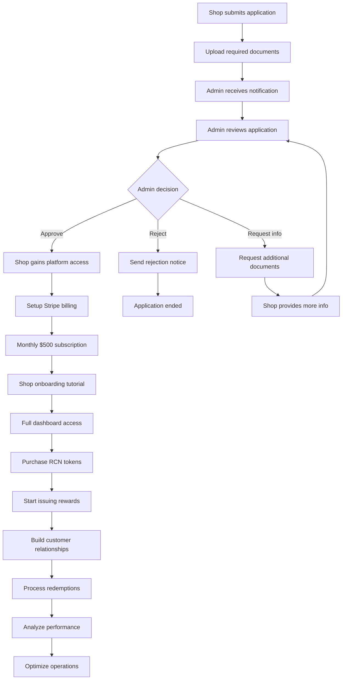

---

## 👥 Customer Tier Progression

### **Tier Advancement System**
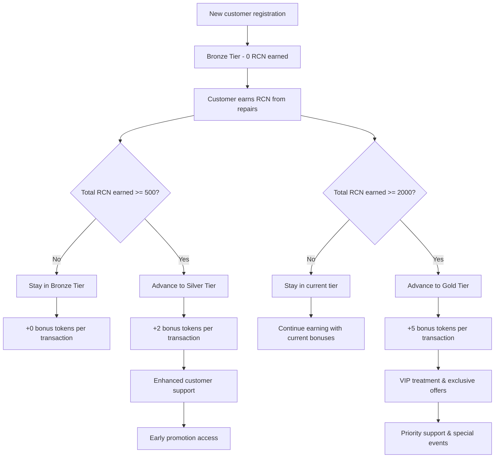

---

## 🚨 Emergency Response Flow

### **Platform Emergency Procedures**
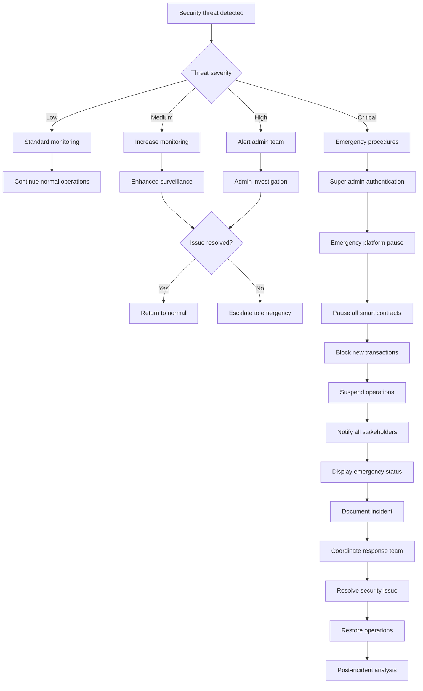

---

## 💳 Token Purchase Flow

### **Shop RCN Token Acquisition**
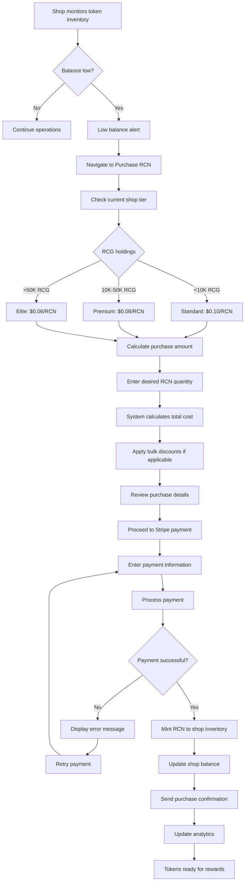

---

## 👤 Customer Referral Flow

### **Referral Program Process**
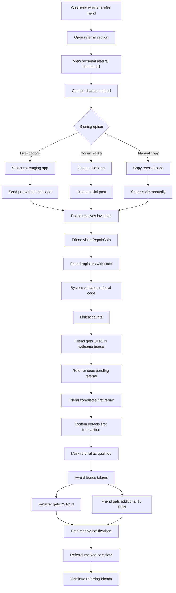

---

## 🔍 Shop Discovery Flow

### **Customer Shop Selection Process**
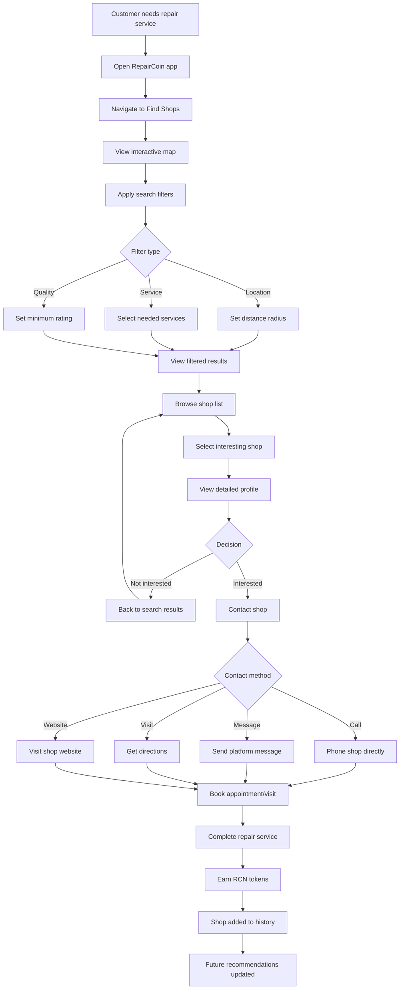

---

## 🛡️ Security & Compliance Flow

### **Admin Security Response Process**
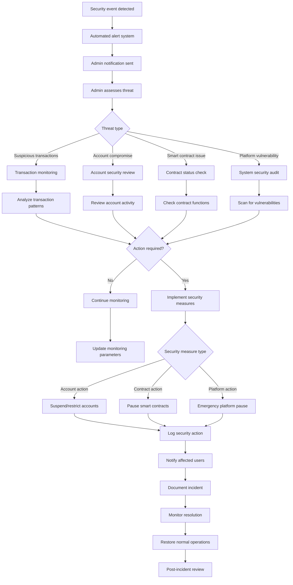

---

## 📊 Analytics & Reporting Flow

### **Admin Data Analysis Process**
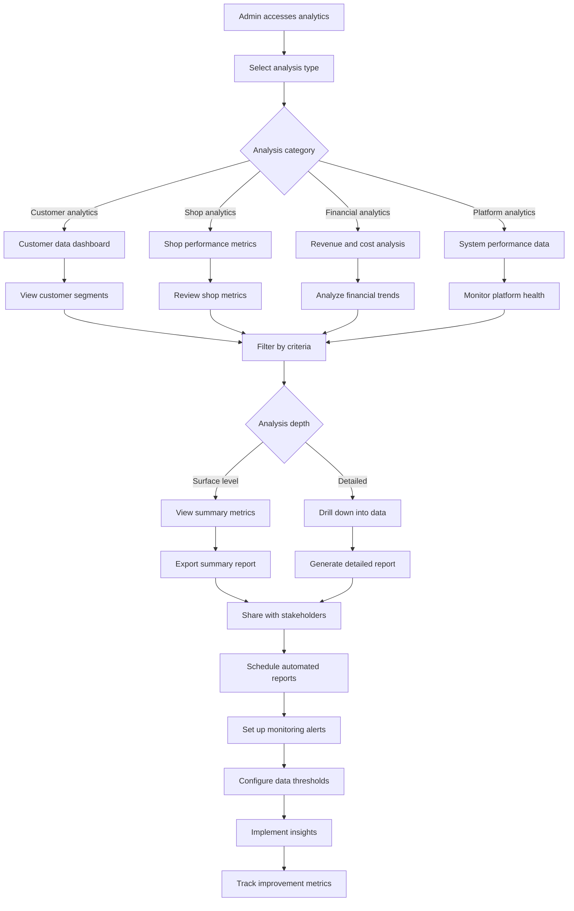

---

## 💡 Integration Flow

### **Third-Party System Integration**
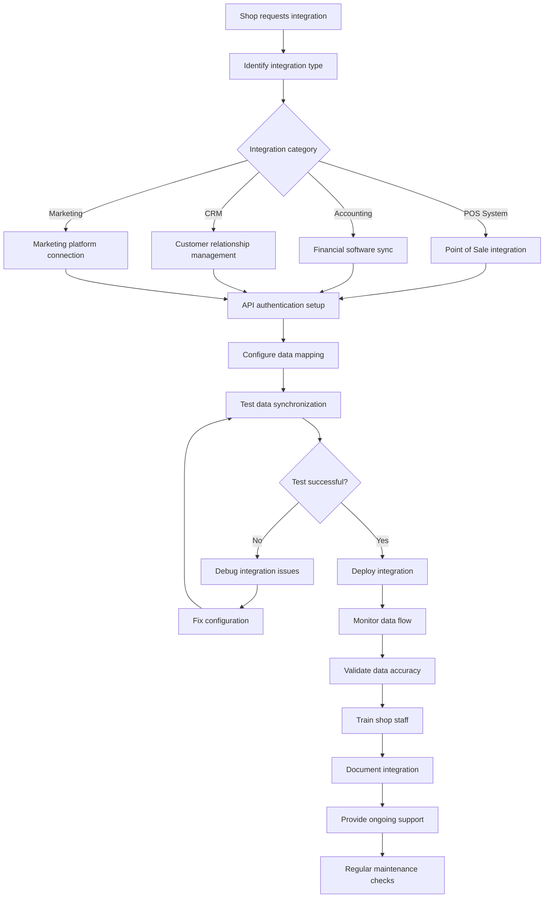

---

## 📱 Mobile App Flow

### **Customer Mobile Experience**
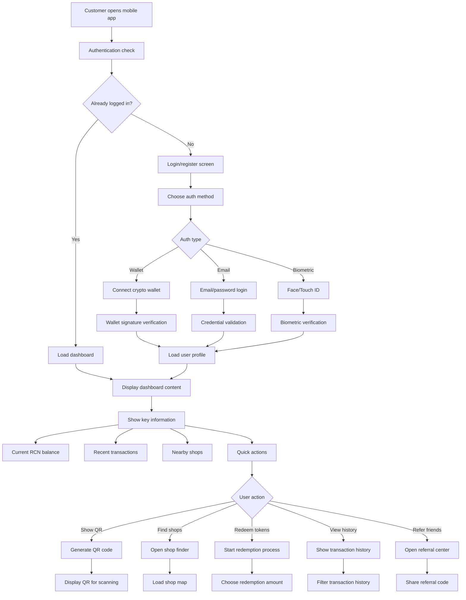

---

*These flowcharts provide visual representations of the key RepairCoin processes. For detailed step-by-step instructions, refer to the specific feature documentation files.*